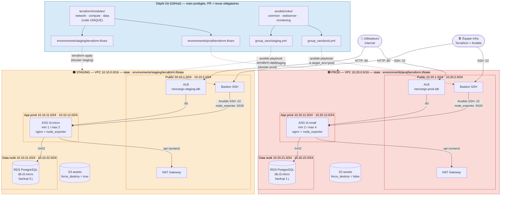

# Schéma d'architecture multi-environnement — NeoCargo TrackFleet

Les deux environnements sont **deux instances des mêmes trois modules Terraform**
(`network`, `compute`, `data`), chacune dans son propre VPC, avec son propre
state local. Seules les valeurs de `terraform.tfvars` diffèrent.

> Le diagramme ci-dessous est rendu automatiquement par GitHub (Mermaid).
> Pour le rapport PDF / la soutenance, on peut l'exporter en PNG depuis
> <https://mermaid.live> (copier-coller le bloc).

## 1. Vue d'ensemble

## 2. Légende

| Élément | Signification |
|---|---|
| 🟦 Bloc bleu | Code versionné (un seul exemplaire des modules et des rôles) |
| 🟧 Bloc orange | Environnement **staging** (VPC, state et ressources propres) |
| 🟥 Bloc rouge | Environnement **prod** (VPC, state et ressources propres) |
| Flèche pleine | Flux réseau autorisé par un security group (port indiqué) |
| Flèche pointillée | Action de déploiement (Terraform / Ansible) lancée par l'équipe |
| Cylindre | Stockage de données (RDS, S3) |
| Public / App privé / Data isolé | Les 3 niveaux réseau. *App* sort sur Internet via la NAT uniquement ; *Data* n'a aucune route sortante |

Chaîne des security groups (identique dans les deux environnements) :
`Internet → ALB (80) → app (80) → RDS (5432)` et `admin → bastion (22) → app (22, 9100)`.

## 3. Ce qui différencie staging et prod

| Paramètre | Staging | Prod | Où c'est défini |
|---|---|---|---|
| CIDR VPC | 10.10.0.0/16 | 10.20.0.0/16 | `terraform.tfvars` |
| Type d'instance app | t3.micro | t3.small | `terraform.tfvars` |
| ASG min / desired / max | 1 / 1 / 2 | 2 / 2 / 4 | `terraform.tfvars` |
| Classe RDS | db.t3.micro | db.t3.micro (quota Academy) | `terraform.tfvars` |
| Sauvegardes RDS | 0 jour (jetable) | 1 jour | `terraform.tfvars` |
| S3 `force_destroy` | true (détruit/recréé souvent) | false (protège les objets) | `terraform.tfvars` |
| Niveau de log nginx | info | warn | `group_vars/*.yml` |
| Page de debug | affichée | masquée | `group_vars/*.yml` |
| Log node_exporter | debug | info | `group_vars/*.yml` |
| Contrôle de santé (cron) | toutes les 1 min, logue aussi les succès | toutes les 5 min, erreurs seulement | `group_vars/*.yml` |
| Seuil d'alerte disque | 90 % | 80 % | `group_vars/*.yml` |
| Tag `Environment` | staging | prod | `locals` de `main.tf` (depuis `var.environment`) |
| Fichier de state | `environments/staging/terraform.tfstate` | `environments/prod/terraform.tfstate` | backend local |
